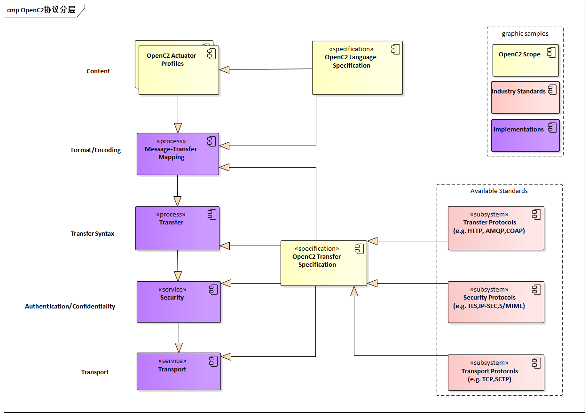
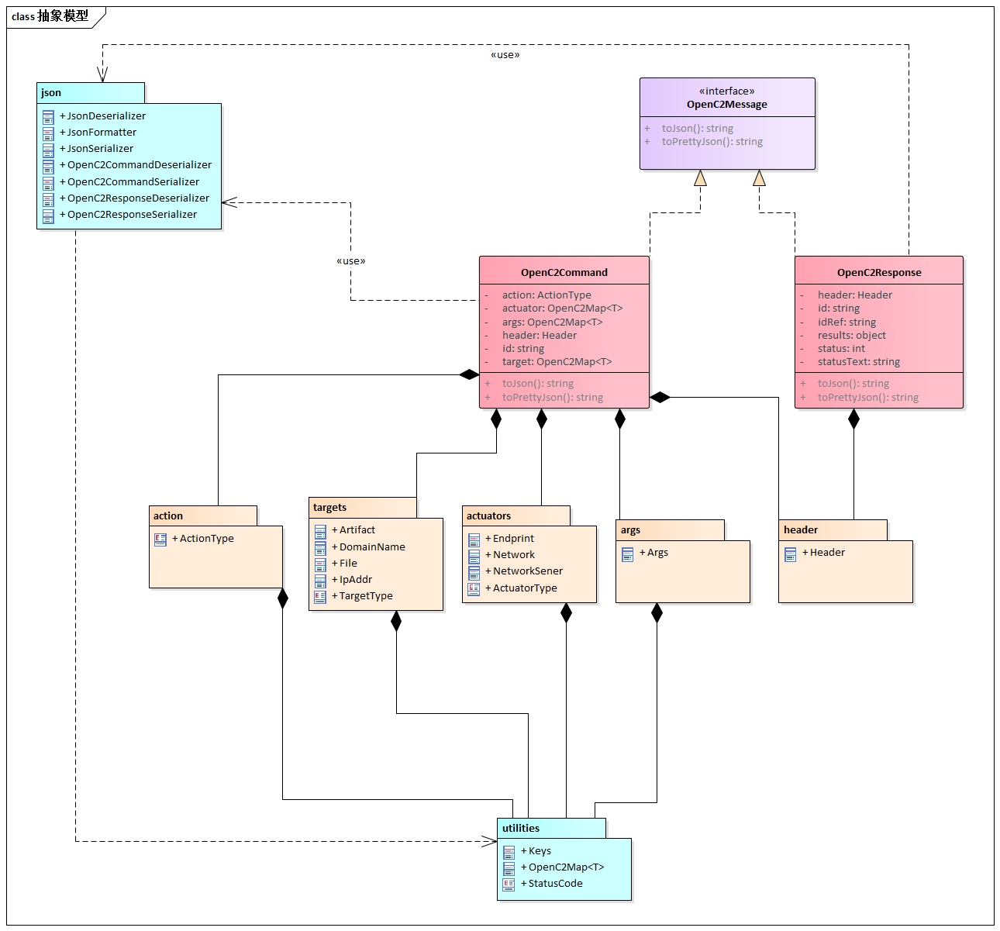
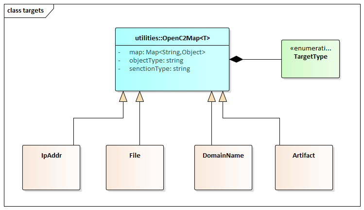
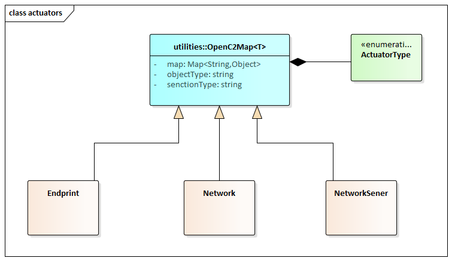

# OpenC2-Java

 

- [OpenC2-Java](#openc2-java)
  - [OpenC2介绍](#openc2%e4%bb%8b%e7%bb%8d)
    - [目标](#%e7%9b%ae%e6%a0%87)
  - [OpenC2 基础组件](#openc2-%e5%9f%ba%e7%a1%80%e7%bb%84%e4%bb%b6)
  - [OpenC2消息交换](#openc2%e6%b6%88%e6%81%af%e4%ba%a4%e6%8d%a2)
    - [OpenC2语言规范基本结构](#openc2%e8%af%ad%e8%a8%80%e8%a7%84%e8%8c%83%e5%9f%ba%e6%9c%ac%e7%bb%93%e6%9e%84)
  - [OpenC2协议分层](#openc2%e5%8d%8f%e8%ae%ae%e5%88%86%e5%b1%82)
    - [OpenC2协议层](#openc2%e5%8d%8f%e8%ae%ae%e5%b1%82)
  - [OpenC2 Command和Response](#openc2-command%e5%92%8cresponse)
    - [OpenC2 Command](#openc2-command)
    - [OpenC2 Response](#openc2-response)
  - [OpenC2-Java模型](#openc2-java%e6%a8%a1%e5%9e%8b)
    - [整体抽象模型](#%e6%95%b4%e4%bd%93%e6%8a%bd%e8%b1%a1%e6%a8%a1%e5%9e%8b)
    - [Target模型](#target%e6%a8%a1%e5%9e%8b)
    - [Actuators模型](#actuators%e6%a8%a1%e5%9e%8b)
    - [JSON序列化模型](#json%e5%ba%8f%e5%88%97%e5%8c%96%e6%a8%a1%e5%9e%8b)

## OpenC2介绍

### 目标

**`OpenC2`语言规范的目标是提供一种在网络防御系统的功能元素之间进行互操作的语言**。 该语言与`OpenC2`执行器配置文件和`OpenC2`传输规范结合使用，允许与供应商无关的网络攻击响应。

综合自适应网络防御（`IACD`）框架基于传统的`OODA`（观察 - 定位 - 决定 - 行动）循环[IACD](https://translate.googleusercontent.com/translate_c?depth=1&rurl=translate.google.com&sl=auto&source=gtx_c&sp=nmt4&tl=zh-CN&u=https://docs.oasis-open.org/openc2/oc2ls/v1.0/cs01/oc2ls-v1.0-cs01.html&xid=17259,15700002,15700023,15700186,15700191,15700256,15700259,15700262,15700265&usg=ALkJrhixiT6pLmGOLu_kVUC6CFZLiEwSFg#iacd)定义了一系列活动：

- `Sensing`(感知)：收集有关系统活动的数据
- `Sense Making`(意图理解)：使用分析来评估数据，以了解正在发生的事情
- `Decision Making`(决策)：确定响应系统事件的行动方案
- `Acting`(行动)：执行行动过程

`OpenC2`的目标是在执行网络防御功能的解耦块之间实现网络相关时间的协调防御。

`OpenC2`侧重于`IACD`框架的`acting`(执行)部分; 作为`OpenC2`设计基础的假设是已经提供了`sensing/analytics`(传感/分析)并且已经做出了采取行动的决策。 这个目标和这些假设指导`OpenC2`的设计：

- `Technology Agnostic`（技术无关性）： `OpenC2`语言以平台和实现无关的方式定义了一组抽象的原子网络防御行为
- `Concise`(简洁性)：命令旨在仅传达描述所需操作所需的基本信息，并且可以以非常紧凑的形式表示，以适应通信受限的环境
- `Abstract`(抽象性)：命令和响应是抽象定义的，可以根据不同实现环境的需要通过多种方案进行编码和传输
- `Extensible`(可扩展性)：虽然`OpenC2`定义了一套用于网络防御的核心动作和目标，但该语言有望随着网络防御技术的发展而发展，并允许扩展以适应新的网络防御技术。

## OpenC2 基础组件

1. **生产者** ：生产者是一个实体，它创建命令以向一个或多个系统提供指令，以根据命令的内容进行操作。 生产者可以与命令一起接收和处理响应。
2. **消费者** ：消费者是接收并可能对命令采取行动的实体。 消费者可以创建响应，提供捕获或发送回制作人所需的任何信息。

## OpenC2消息交换

`OpenC2`是生产者和消费者的一套规范，用于指挥和执行网络防御功能。 这些规范包括`OpenC2`语言规范，执行器配置文件和传输规范。

`OpenC2`语言规范和执行器配置文件规范侧重于命令和响应的生产者和消费者的语言内容和含义，而转移规范侧重于交换协议。

- `OpenC2`语言规范：提供了语言基本元素的语义，命令和响应的结构，以及定义表示命令或响应的语言元素的正确语法的模式。
- `OpenC2`执行器配置文件：指定在特定执行器功能的上下文中相关的`OpenC2`语言的子集。 网络防御组件，设备，系统和/或实例可能（实际上可能）实现多个执行器配置文件。 执行器配置文件通过定义将执行器标识为所需精度级别的说明符来扩展语言。 执行器配置文件可以定义与这些执行器功能相关和/或唯一的命令参数和目标。
- `OpenC2`传输规范：利用现有协议和标准在特定环境中实现`OpenC2`。 这些标准用于超出语言范围的通信和安全功能，例如消息传输编码，身份验证和`OpenC2`消息的端到端传输。

### OpenC2语言规范基本结构

`OpenC2`语言规范定义了一种语言，用于组成用于命令和控制网络防御系统和组件的消息。

消息由`Header`和`Payload`组成（在[OpenC2语言规范版本1.0](https://docs.oasis-open.org/openc2/oc2ls/v1.0/cs01/oc2ls-v1.0-cs01.html)中定义为消息主体，并在一个或多个执行器配置文件中指定 ）。

该语言规范定义了两个`Payload`结构

- 命令（`Command`） ：从一个系统（称为生产者）到一个或多个系统（消费者）的指令，用于对命令的内容进行操作。
- 响应 (`Response`)：由命令返回生产者的任何信息。

## OpenC2协议分层

`OpenC2`实现将上述相关的`OpenC2`规范与相关的行业规范，协议和标准集成在一起。

下图描述了`OpenC2`规范之间的关系，以及它们与其他行业标准和`OpenC2`的特定于环境的实现之间的关系。 

> 注意，图中的实现方面的分层是概念性的，并不旨在排除实现所需功能的任何特定方法
>
>（例如，使用应用层消息签名功能来提供消息源认证和完整性）。

### OpenC2协议层

| 协议层 | 例子 |
|--|--|
| Function-Specific Content | 执行器配置文件   ([[OpenC2-SLPF-v1.0](https://docs.oasis-open.org/openc2/oc2ls/v1.0/cs01/oc2ls-v1.0-cs01.html#openc2-slpf-v10)],...)|
| Common Content | Language Specification |
| Message | Transfer Specifications   ([[OpenC2-HTTPS-v1.0](https://docs.oasis-open.org/openc2/oc2ls/v1.0/cs01/oc2ls-v1.0-cs01.html#openc2-https-v10)], `OpenC2-over-CoAP`, ...) |
| Secure Transport | `HTTPS`, `CoAP`, `MQTT`, `OpenDXL`, ... |

- `Secure Transport`层提供`Producer`和`Consumer`之间的通信路径。 `OpenC2`可以通过任何标准传输协议进行分层。
- `Message`层提供传输和内容无关的机制来传递消息。 传输规范将特定于传输的协议元素映射到由内容和相关元数据组成的与传输无关的消息元素集。
- `Common Content`层定义了`Commands`和`Responses`的结构以及用于构造它们的一组公共语言元素。
- `Function-Specific Content`层定义用于支持特定网络防御功能的语言元素。 `Actuator`配置文件定义了该功能的实现一致性要求。 生产者和消费者将支持一个或多个配置文件。

## OpenC2 Command和Response

### OpenC2 Command

`Command`是由`Action`（要做什么），`Target`（正在执行的操作），可选的`Actuator`（执行命令的是什么）和`Command Arguments`这几部分组成，它们影响命令的执行方式。 

`Target`(目标)与`Action`(动作)结合足以描述完整的`Command`。 

虽然`Actuator`和`Command Arguments`是可选的，但是可以为`Command`提供额外的精度。

### OpenC2 Response

`Response`由数字格式的`StatusCode`(状态码)，以及可选的字符串格式的`status text`(状态文本)和可选`results`(结果)组成。 `result`s的格式取决于要返回的响应的数据类型。

## OpenC2-Java模型

### 整体抽象模型

### Target模型

### Actuators模型

### JSON序列化模型

